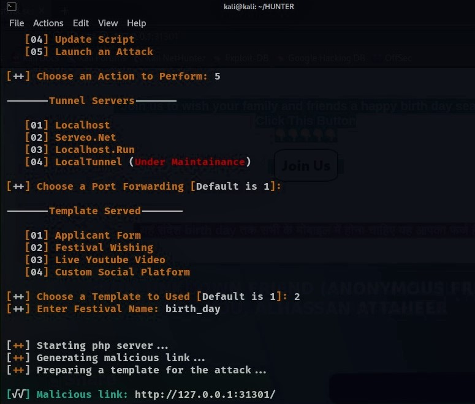
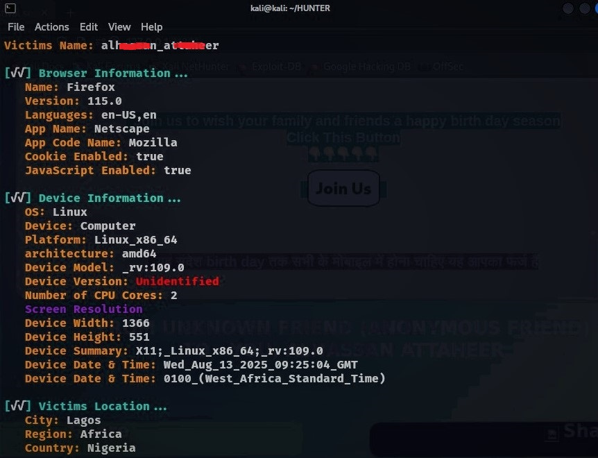
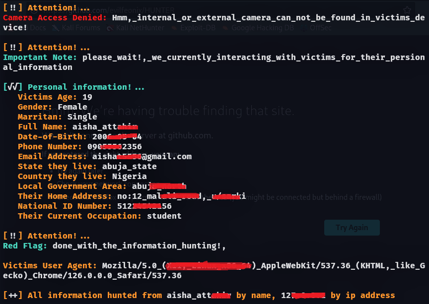
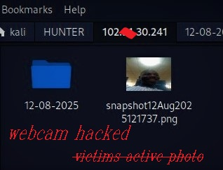

<div align=center>

<a href="https://github.com/evilfeonix/HUNTER"></a> 

 

    
<a href="https://github.com/evilfeonix/HUNTER/stargazers/"></a>
<a href="https://github.com/evilfeonix/HUNTER/network/members"></a>

<a href="https://github.com/evilfeonix/HUNTER/"></a>
<a href="https://github.com/evilfeonix/HUNTER/commit-activity"></a>&nbsp;&nbsp;
</div>

_Know who your victims are, where they lives, device they used and language they understand, by using our increadible hacking tool named `HUNTER`!_

Hunter!, a social engineering tool that similate phishing attack, it focus on gathering information by hacking and maniplating victims to makes them reveals much more of their information to attacker, 

With Hunter, you can easily know much about your victims, and plan a successful feature attack, examples.
- See if their browser is vulnerable to other cyber attacks
- Used our `word-gen` to generate a list of password based on victims information

# **Features**:
1. Hunter detect the date and time victims visit our malicious link
3. Hunter force victims to reveals their full names to attacker
2. Hunter display victims full name and their device ip address
3. Hunter force victims to enable access to camera and GPS location
4. Hunter hack victims front camera, takes several pic, send them to attacker 
5. Hunter uses geo to convert victims exact location into home address 
5. Hunter used google map to mapped victims exact location 
6. Hunter track down victims movement in our malicious website 
6. Hunter report any error concerning accessing camera and GPS location 


# **OS used**:
- Termux
- Kali Linux

# **Requeirments**:
1. php.
2. ssh.
3. npm.

# **Installation and usage**:
```bash
git clone https://github.com/evilfeonix/HUNTER.git
```
```
cd HUNTER
```
```
sed -i 's/\r$//' hunter.sh
```
```
chmod u+x hunter.sh
```
```
./hunter.sh
```

# **Template served by Hunter**:
1. Applicant Form: allows victims to enter their personal information
2. Festival Wishing: wish victims a festival day and grab their personal information
3. Live Youtube Video: use youtube video to foolish victims and grab their information
4. Custom Social Platform: pretend to be a lagitimate platform and grab their information

>**Important: If you select `Festival Wishing` template, we will ask you to enter "festival name", if the festival name include space (eg."New Year"), then replace it with underscore (eg."New_Year"), if not, the script will produce an error**.

# **Tunnel server served by Hunter**:
1. Localhost.
2. Serveo.net. 
3. LocalTunnel. 
4. Localhost.run.

>**Important: All the tunnel server can be accessible around the world but Localhost can only be active in local machine (_use it to exprienced how this tool works_).**.

# **Information hunted by this tool in summary**:
- Browser information: name, version, language, appName, appCodeName, cookieEnable
- Device information: name, version, model, platform, architecture, date & time in full format, Number of CPU Cores
- Personal information: fullname, age, gender, phone number, email address, state, LGA, home address, national ID number, occupation
- Location Information: city, region, country, timezone, latitude, longitude, exact address and map location 
- And other information that can not be listed here.

# HUNTER Screenshot Sample 




 

<div align=center>

Thanks for your supports, _Happy Hacking!_\
_Happy Hunting Victims Informations_\
🚀🚀🚀!.
</div>


